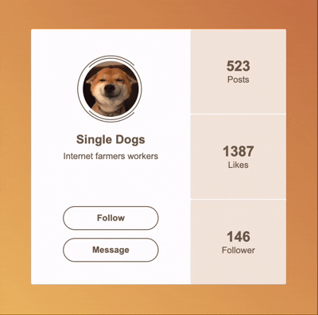

# 100 天 CSS 挑战
这是一个记录 [100 天 CSS 挑战](https://100dayscss.com/)的仓库，旨在通过完成一系列小项目，提升 CSS 技能。 每个项目都涉及不同的设计与实现，帮助加深对 CSS 的理解。

---

## 预览 

以下展示了部分已完成的练习效果，点击每个练习标题可查看源码：

### 001：[标题](./001-title/)

### 002：[菜单按钮](./002-menu-icon/)

### 003：[金字塔](./003-the-pyramid/)

### 004：[加载](./004-loading/)

### 005：[统计](./005-statistic/)

### 006：[个人主页](./006-profile/)

### 007：[通知](./007-notifications/)

### 008：[元球](./008-metaballs/)

_（更多练习将会不断更新）_

